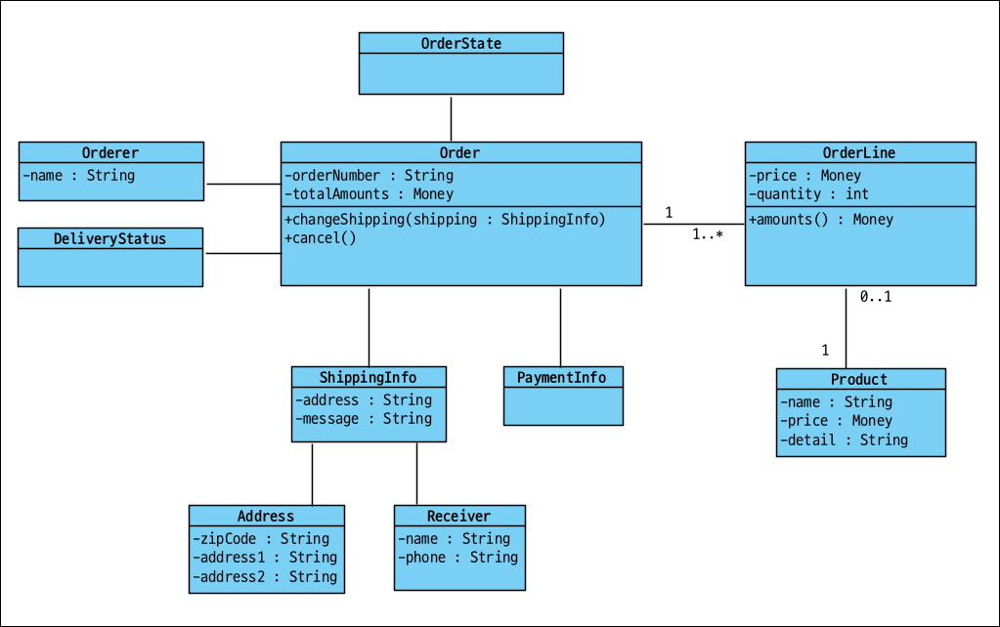
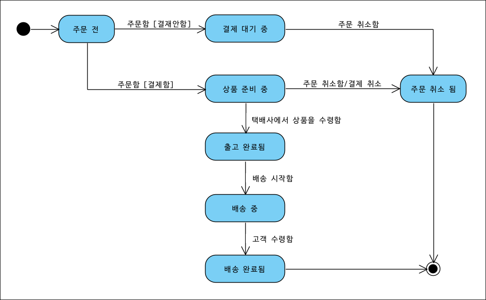

# Chapter 1 도메인 모델 시작하기

> ✨ Spring Security는 좀 나중에 보더라도  확실히 이걸 아는게 급한 것 같다. 
>
> 코드를 따라서 만들어나아가는데 익숙해서, 이미 전체 완성된 코드를 보는건 좀 익숙하지 않은데... 어떻게 해야할까?


## 1.1 도메인이란?

소프트웨어로 해결하고자 하는 문제의 영역


## 1.2 도메인 전문가와 개발자 간 지식 공유

개발자와 전문가가 직접 대화하여 요구사항이 올바르게 설정되야함.

> "Garbage in, Garbage out"
>
> 잘못된 값이 들어가면 잘못된 결과가 나온다.
>
> 🎇 기획 담당자와 대화를 많이해서 올바르고, 최적화된 요구사항을 같이 만들어내자!!! 😄


## 1.3 도메인 모델

#### 객체 기반 주문 도메인 모델




#### 상태 다이어그램을 이용한 주문 상태 모델링




## 1.4 도메인 모델 패턴


## 챕터 진행


### 사용할 DB 생성

일단 MySQL만 사용해보자.

```sql
CREATE SCHEMA `ddd_start_study` DEFAULT CHARACTER SET utf8mb4 ;

CREATE USER 'ddduser'@'localhost' IDENTIFIED BY 'dddpass';
CREATE USER 'ddduser'@'%' IDENTIFIED BY 'dddpass';

GRANT ALL PRIVILEGES ON ddd_start_study.* TO 'ddduser'@'localhost';
GRANT ALL PRIVILEGES ON ddd_start_study.* TO 'ddduser'@'%';
```


### 프로젝트 준비

* https://start.spring.io/ 에서 Spring Boot 3.0 기반으로 추가했다.
  * web, security, jpa, mail, thymeleaf, devtools
  * mybatis : 나중에 쓰시는 데가 있나?

* 프로젝트는 하나를 가지고 계속 내용 추가해나가는 것이므로, 단일 프로젝트로 두자!

  * [ddd-start-study 프로젝트](../ddd-start-study)

* 프로젝트 실행

  * 웹실행

    ```bash
    gradlew clean bootRun
    ```

    아무것도 한게 없고 Spring Security 만 붙어있어서 로그인 페이지만 뜬다.

  * 테스트 실행

    ```bash
    gradlew clean test --tests *DddStartStudyApplicationTests.contextLoads
    ```

    

  


## 정오표

* ...
